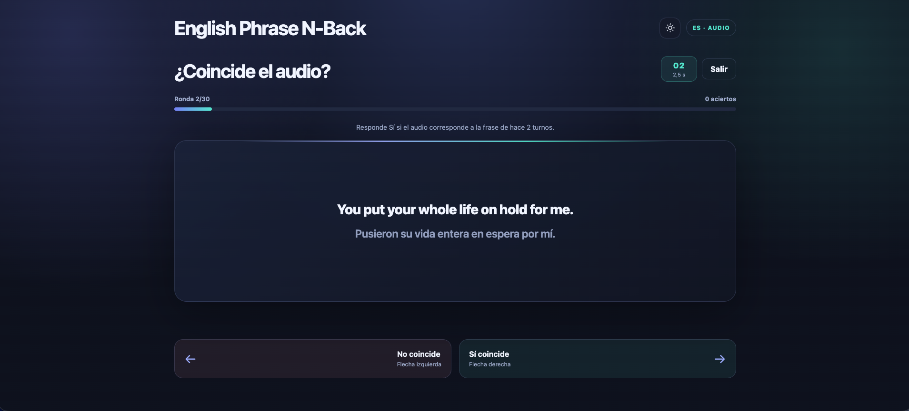

# English Phrase N-Back

Aplicación web local para practicar inglés con frases tomadas de subtítulos `.srt`. Tras un breve calentamiento, lees una frase y escuchas otra en cada turno; el reto es recordar la secuencia y decidir si ambas corresponden a la misma frase.



## ¿Qué es el n-back?

En la tarea n-back se presenta una secuencia continua de estímulos. En cada paso hay que decidir si el estímulo actual coincide con el que apareció **n pasos antes**. Por ejemplo, en un 2-back se compara con el de hace dos turnos. Para responder, se mantiene y actualiza en memoria la información reciente; aumentar *n* suele hacer más exigente la tarea. Se utiliza en investigación como una tarea de memoria de trabajo, aunque esta aplicación la adapta al aprendizaje de idiomas. [Descripción académica de la tarea n-back](https://pmc.ncbi.nlm.nih.gov/articles/PMC4510348/).

En este juego se comparan dos modalidades: la frase que aparece en pantalla y la frase pronunciada por el audio. La pregunta es si el audio del turno actual corresponde a la frase que viste hace *n* turnos. Las traducciones inglesa y española de una misma entrada cuentan como la misma frase. Los primeros *n* turnos sirven de calentamiento y no se puntúan; después, la sesión intercala coincidencias y distractores.

El objetivo práctico es entrenar la atención al escuchar y leer expresiones en inglés, y volver a encontrarlas dentro de una secuencia. El audio se sintetiza a partir del texto de los subtítulos: la aplicación no reproduce el audio original de una película o serie.

## Requisitos

- Python 3.10 o posterior.
- Un navegador moderno con sonido.
- Para crear un catálogo desde `.srt`: conexión a internet durante la primera descarga de los modelos y espacio suficiente para guardarlos. La traducción usa NLLB-200; la voz neural usa MMS-TTS. Según la voz elegida, el audio también puede generarse con las voces instaladas de macOS.

## Ejecutar

Desde la carpeta del proyecto, crea un entorno e instala las dependencias:

```bash
python3 -m venv .venv
.venv/bin/python -m pip install --upgrade pip
.venv/bin/python -m pip install -r requirements.txt
.venv/bin/python server.py
```

En Windows, usa estos comandos equivalentes:

```powershell
py -3 -m venv .venv
.venv\Scripts\python -m pip install --upgrade pip
.venv\Scripts\python -m pip install -r requirements.txt
.venv\Scripts\python server.py
```

Abre [http://localhost:8000](http://localhost:8000). El proyecto incluye un catálogo y audios ya preparados, así que puedes empezar con ellos sin procesar subtítulos. Para detener el servidor, vuelve a la terminal y pulsa `Ctrl+C`.

## Crear frases desde subtítulos

1. Copia subtítulos en inglés en formato `.srt` a `subtitles/`.
2. Con el servidor en marcha, abre o recarga la aplicación y elige el archivo en **Generar desde subtítulos**.
3. Elige las voces para inglés y español y pulsa **Procesar subtítulos**. La aplicación extrae frases, las traduce al español y crea audios `.wav`; el panel muestra el progreso. La primera ejecución puede tardar mientras se descargan los modelos.
4. Al terminar, el catálogo queda listo para preparar una partida.

El procesamiento selecciona frases del archivo de forma aleatoria y genera un conjunto según la duración de la partida. **Cada nuevo procesamiento reemplaza `data/phrases.json` y elimina los audios procesados anteriores de `audio/`** antes de crear los nuevos.

## Jugar

1. Selecciona el nivel (de 1-back a 4-back), el número de rondas y el idioma del audio. Puedes elegir si la frase principal aparece en inglés o en español; también se muestra su traducción.
2. Ajusta el tiempo por frase entre 2 y 15 segundos (8 segundos por defecto) y pulsa **Preparar sesión**. Cuando los audios estén listos, pulsa de nuevo el botón para empezar.
3. En cada turno puntuable, responde **Sí coincide** con la flecha derecha si el audio corresponde a la frase de hace *n* turnos; si no, responde **No coincide** con la flecha izquierda. También puedes usar las teclas `→` y `←`.
4. Al finalizar verás los aciertos, errores, omisiones y precisión. El historial se guarda en el almacenamiento local del navegador.

Las rondas de calentamiento no cuentan dentro del total elegido. Durante la partida, el navegador reproduce los audios ya preparados; no se generan nuevas voces en mitad de una sesión.
